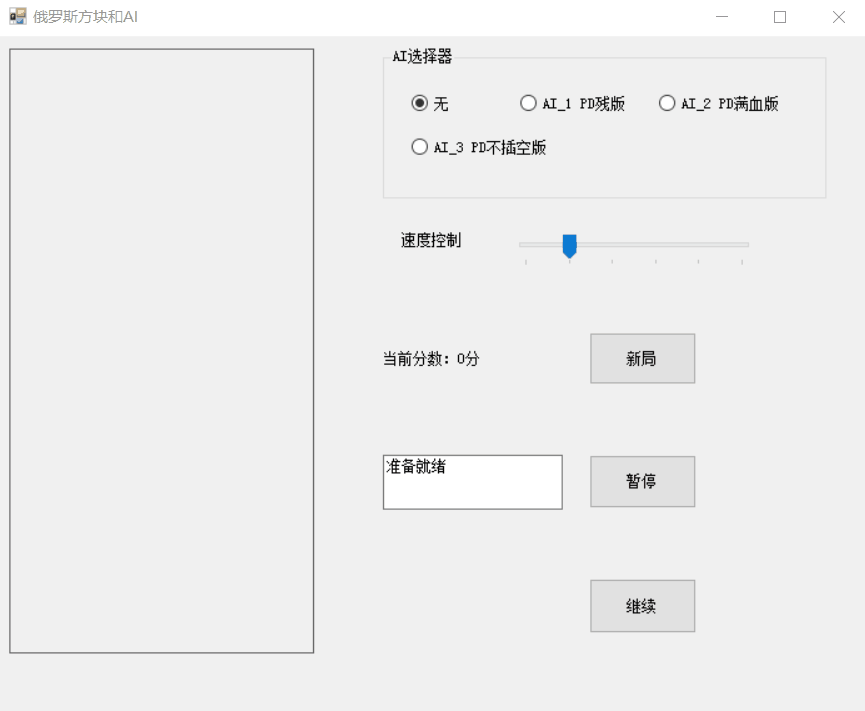
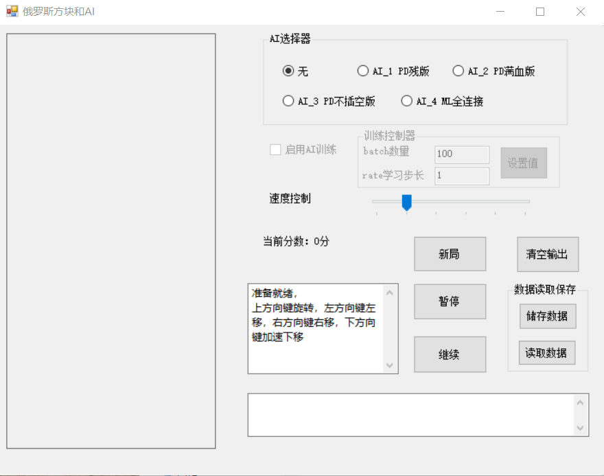
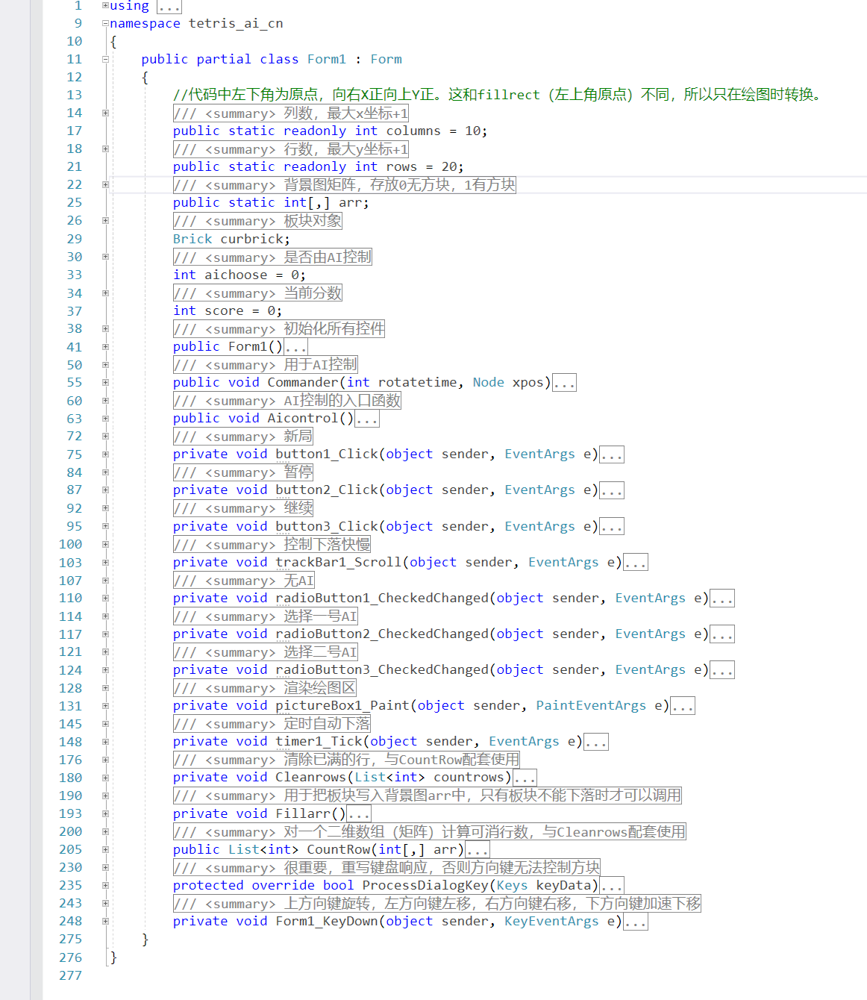
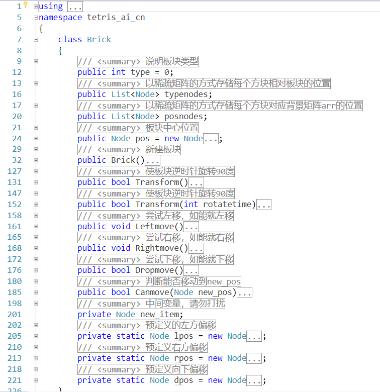

# tetris_ai

C#俄罗斯方块，带大量中文注释，便于AI接口和魔改(｀・ω・´)……因为网上找的代码太难用了自己重构一个

--------
开发环境 .NET Framework 4, Visual Studio 2017

运行环境 Windows && .NET Framework 4+

------------
2019.2.14更新：主要的俄罗斯方块代码在/tetris_ai_cn文件夹下，/showarrincolor文件夹是把数组可视化的一个小工具，/huge_data文件夹下含有尝试全连接AI和小工具产生的大量数据。

 2019.2.6更新：[tetris_ai_cn.exe](./tetris_ai_cn.exe)，已经有三个AI啦~虽然都是PD算法

**方向键左、右、下控制板块向左、向右、向下，方向键上使板块变形**

------------

其他内容看注释！有问题先看注释！看注释！

如果这么详细的注释看不懂，(｀・ω・´) <del>吔shi啦你</del>

***代码已经更改过了，截图仅供示意***

---------------------
对了，代码结构有部分来自于以下两位开源coder

[AItetris-4.zip @ G@rage](http://xianka.luobotou.org/?p=103)

[Tetris.zip @ qian_f](https://blog.csdn.net/qian_f/article/details/19758671)

你可以在本项目的reference文件夹中下载他们的源码

----------------------
## 2019.2.6更新

>关于PD算法比较好的理解，转自 [SimpleTetris @ bingghost](https://github.com/bingghost/SimpleTetris/blob/master/README.MD)

## Pierre Dellacherie算法：（只考虑当前方块） 
> Pierre Dellacherie官网:
http://imake.ninja/el-tetris-an-improvement-on-pierre-dellacheries-algorithm/

AI算法主要是评分函数: 所以只介绍评分函数
    尝试着对当前落子的每一种旋转变换、从左到右地摆放，产生所有摆法。
    对每一种摆法进行评价。评价包含如下6项指标

###### 1.下落高度（Landing Height）： 
> 当前方块落下去之后，方块重心距底部的方格数
> 事实上，不求中点也是可以的，详见官网。

###### 2.消行数（Rows eliminated） 
> 消行层数与当前方块贡献出的方格数乘积 
 
######  3.行变换（Row Transitions）： 
>* 从左到右（或者反过来）检测一行，当该行中某个方格从有方块到无方块（或无方块到有方块）， 
>* 视为一次变换。游戏池边界算作有方块。行变换从一定程度上反映出一行的平整程度，越平整值越小 
>* 该指标为所有行的变换数之和 
>* 如图：■表示有方块，□表示空格（游戏池边界未画出） 
>* ■■□□■■□□■■□□ 变换数为6 
>* □□□□□■□■□■□■ 变换数为9 
>* ■■■■□□□□□□■■ 变换数为2 
>* ■■■■■■■■■■■■ 变换数为0 
 
###### 4.列变换（Column Transitions）：大意同上 
> 列变换从一定程度上反映出一列中空洞的集中程度，空洞越集中值越小 
 
###### 5.空洞数（Number of Holes） 
> 上方有方块的空位 
> 如图有三个空洞：
>*        ■■■ 
>*        ■□■ 
>*        ■□■ 
>*        ■□■ 
 
###### 6.井的总和（Well Sums）： 
> 井指两边皆有方块的空列。该指标为所有井的深度连加到1再求总和 
> 注意一列中可能有多个井，有些既是洞也是井，如图： 
>*        ■□□ 
>*        ■□■ 
>*        ■□■ 
>*        ■■■ 
>*        ■□■ 
>*        ■□■ 
>*        ■□■ 
> 中间一列为井，深度连加到一的和为 (2+1)+(3+2+1)=9 
 
###### 各项指标权重经验值：

|索引| 权重|
|---|----|
|1  |  -4.500158825082766 
|2  |  3.4181268101392694 
|3  |  -3.2178882868487753 
|4  | -9.348695305445199 
|5  | -7.899265427351652 
|6  | -3.3855972247263626 

-----------------
最后提一句，这里坑真多！先仔细阅读PD算法说明，注意“插空”与否，随时提防越界和null和bug！(￣▽￣)／